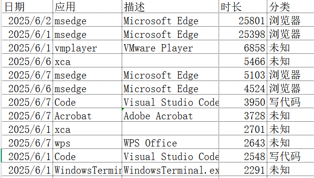
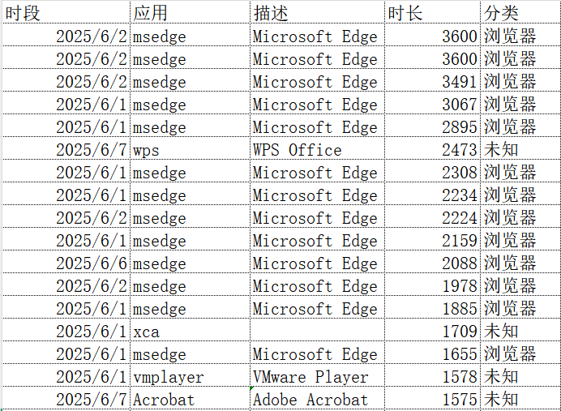
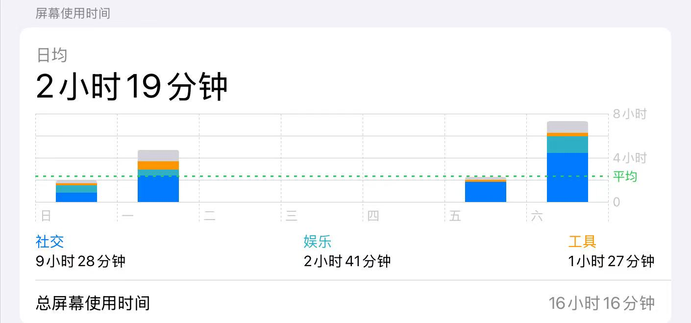

上次写，一眨眼，似乎又是半个月前了，主要是不知道该写什么了。
这周的杂事比较多，就顺手写一点。

本次日记包含三个板块：数字证书的折腾、生地会考的紧张、关于班级的思考。

{/* truncate */}

## 一、数字证书的折腾

自己搞了一个自签根证书，下面挂了好几个多级 CA。  
这个过程还挺曲折的。

我也不知道为什么搞这个，又复杂，实际上安全性可能还比不上权威 CA 机构（因为私钥可能保管不当）。

最开始用的是命令行，按照 [DeepSeek](https://chat.deepseek.com) 的指导一行一行敲的，然后就搞定权限和描述极其混乱。第二周就按照 DeepSeek 的意见换上 [XCA](https://github.com/chris2511/xca/) 这个开源图形化管理软件了，挺好用的，但是按照 Github 上 issues 的情况来看，几乎停止维护了？

个人用户倒也用不上太过高的安全性，这样基本也是勉强够用了。

之后，我个人自用的、或是一些公开的东西（尤其是pdf文档）都**可能**会用数字证书签名来保证文件的不可否认性、权威性。

但由于个人使用不可避免的一些影响，其权威性等并不严格，可能不具有可靠的法律效力。

顺带一提，还有[《电子签名法》](https://baike.baidu.com/item/%E4%B8%AD%E5%8D%8E%E4%BA%BA%E6%B0%91%E5%85%B1%E5%92%8C%E5%9B%BD%E7%94%B5%E5%AD%90%E7%AD%BE%E5%90%8D%E6%B3%95/1780444)在法律上对电子签名做了规定。

*证书详见[这里](https://cn-zwz.github.io/CA/)或之后另行公布的其它渠道。*

## 二、 生地会考的紧张

生地会考在即，也就是下下个周五了，说近不近，说远绝对不远。

可是依旧是之前说过的问题：我周末花在学习上的时间越来越少。  
这肯定是一种不好的趋势，我也要尝试去改善。

像我之前给自己使用的几乎是所有设备都启用了各种平台的屏幕使用时间统计。  
ios，也就是我的 ipad 用的系统的；电脑用的开源软件 [Tai](https://github.com/Planshit/Tai)；那台我奶奶传下来的手机用的 番茄ToDo，刚好开了会员有这个功能，不好用，但是能用。

而具体的使用时间，非常抽象。

像我的电脑：

<small>Use Tai to record</small>

iPad中：

---

到了八下了，之后的方向再不决定就真的晚了。所以，化学、全科以及其它方向，我必须做一个好好的全面评估了。  
具体而言，就是在暑假抽出时间，将学过的回顾一遍、评估一下；也往后学一下，或多或少，至少心中有个数。

当然，很多事，我一个人不好完成，几乎是必定要借助他人的力量——**无论以前、现在还是遥远的将来**。

这也算是我给自己下的一个小决心。

## 三、关于班级的思考

有个事情大致如下：

> 本周五，临散学时，胡先生因多人疑似与某生语，违堂规，入室后骤怒，直指其人。
> 该生自谓冤屈，与辩，然其素行有亏，兼有别故，势蹙。
> 力陈：“适才未发一言，喧哗、怠业云云皆虚妄。”
> 胡闻之益恚，曳之于门外。俄而蒋至。
> 后不得知。
>
> ——DeepSeek-R1 基于[原稿](file/2025-06-07_OriginalManuscript.txt)修改

从我的视角来讲，我不赞同主动闹事的一方的处理方式，但由于我不知道事情的全貌，不知道涉事同学的陈述是否属实，故也不代表我支持另一方的做法。
至于我这里说的“主动闹事的一方”是谁吗……你猜。

但是有一点我认为要说一下：骂人。

> “你难道就不让别人骂了吗？”

对于教师，尤其是一个优秀的人民教师，（对学生等）讲侮辱性的语言自然不行。易证，请读者自证。

此外，根据[《中华人民共和国未成年人保护法》](https://baike.baidu.com/item/%E4%B8%AD%E5%8D%8E%E4%BA%BA%E6%B0%91%E5%85%B1%E5%92%8C%E5%9B%BD%E6%9C%AA%E6%88%90%E5%B9%B4%E4%BA%BA%E4%BF%9D%E6%8A%A4%E6%B3%95/897876)：
> **第二十七条**  学校、幼儿园的教职员工应当尊重未成年人人格尊严，不得对未成年人实施体罚、变相体罚或者其他*侮辱人格尊严*的行为。

但是，有必要说明的是，骂人、讲侮辱性的语言、侮辱人格尊严三者同而不同。  
In my eyes，骂人是其中范围最宽的。像我也经常骂人，骂谁呢？要么根本没有去骂谁，要么骂自己，或者偶尔骂别人。大多数时候都是充当语气词。

而“侮辱人格尊严”最严重。（由此亦可知：法律是最刚性的社会规则，规定人们行为的**底**线。）

[DeepSeek 的解释](</file/DeepSeek-2025_6_7.htm>)也很到位。